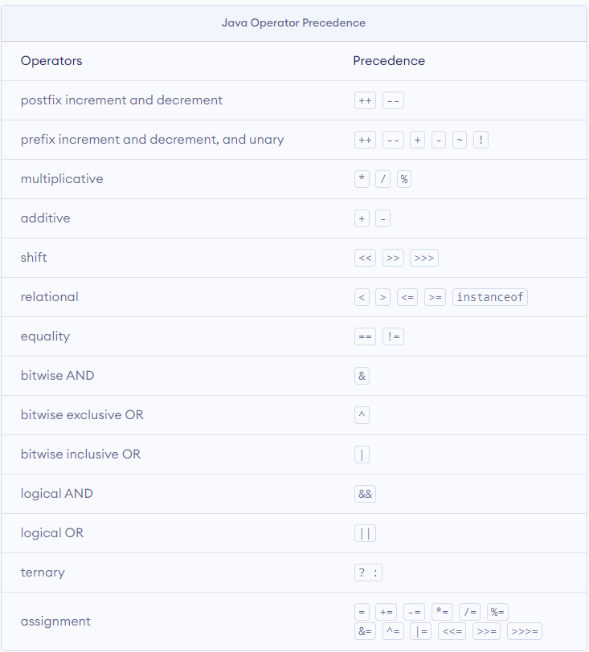

## Operator precedence
Just like in math java has priorities for operators. If you put circle brackets to subtraction it will be executed
earlier than multiplication:

    int result = (2 - 1) * 10;//10 
    int result2 = 2 - 1 * 10; //-8

But this is not only applied for math operators:

Some operators haven't been present yet, so no worries, they will be explained in the next chapters. This basically
means that you need to know the execution precedence of operators in java, because that may impact your business logics.
The same as if you are performing certain operations over numbers in math, some transformation and data processing is
happening with the help of operators in java. And if you declare them in a wrong order that might impact you expected
result and produce unexpected behaviour and bugs. The best tactics if you do not remember the priority for operator is
to use circle brackets.