# Algorithms and Data Structures

## Algorithms overview
### What is algorithm?
An _**algorithm**_ is a set of instructions to solve a particular problem. Any code may be called an algorithm. Computer algorithms work via input and output. They take the input and apply each step of the algorithm to that information to generate an output. For example, a search engine is an algorithm that takes a search query as an input and searches its database for items relevant to the words in the query. It then outputs the results.


### Measuring algorithm performance 
While writing a solution we need to find the most efficient algorithm, when a word "efficient" means "running the least time".

In computer science, a term that describes the amount of time it takes to run an algorithm is called "_**Time Complexity**_". Time complexity is commonly estimated by counting the number of elementary operations performed by the algorithm. It is supposed that each elementary operation lasts a fixed amount of time. Thus, in order to measure "time complexity", we should take into account:
* the amount of time taken by an algorithm;
* the number of elementary operations performed by it.

#### Big O Notation
The time complexity is commonly expressed using "Big O notation" (Landau's symbol). It is a special notation that tells you how fast an algorithm is. It’s called "Big O notation" because you put a “big O” in front of the number of operations.

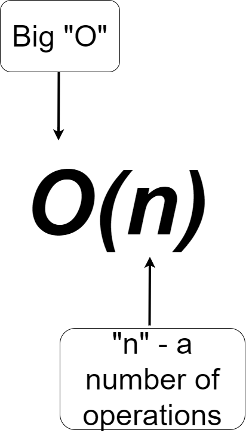

As regards an origin of "Big O notation", it is used in complexity theory, computer science, and mathematics to describe the asymptotic behavior of functions, and it tells you how fast a function grows or declines (you are not supposed to know it, just for your information). Letter "O" is used because the rate of growth of a function is called its ***O***rder.

#### Big O Complexity Chart


"Big O notation" tells us a number of operations, which an algorithm will perform.
There are the following most common types of complexities (from fastest to slowest):
- "O(1)", also known as (henceforce - a.k.a) "_constant time_": the number of operations, which are needed to complete an algorithm, is fixed and doesn't depend on the input number;
- "O(log n)", a.k.a "logarithmic time": the ratio of the operations number to the input size decreases and tends to zero when "n" increases, i.e. the more input is, the less time is needed;
- "O(n)", a.k.a "linear time": running time increases with the size of the input in the linear way, i.e.  ;
- "O(n * log n)", a.k.a "linearithmic time": the "n log n" running time is simply the result of performing a "Θ(log n)" operation "n" times;
- "O(n^2)", a.k.a "quadratic time": the number of operations it performs scales in proportion to the square of the input;
- "O(2^n)", a.k.a "exponential time": any time an input unit increases by 1, it causes you to double the number of operations performed;
- "O(n!)", a.k.a "factorial time": the number of operations it performs scales in proportion to the result of multiplication of all positive integers less than or equal to the input.

"Big O notation" focuses on the "worst-case" scenario. For example, there is a problem, which is to find a contact in your phone book. We choose the following algorithm: look through the phone book from the very beginning to the end. Let's assume that the number of contacts in the phone book is 100 (n=100), and we are looking for a contact named as "Alexandra". It turned out that "Alexandra" is the first entry in the phone book, so in this case the time complexity will be "O(1)" (we performed a constant number of operation: "1", it will be the "best-case" scenario). Now let's find "Yevgeny", who is the last 100th contact (time complexity will be "O(n)"). This case should be considered as the "worst-case" scenario, when we have to look at each contact in the phone book. Thus, the "worst-case" scenario is a concept describing the maximum time complexity for an algorithm.

### Summary
- algorithm is a method for solving a problem;
- algorithm's speed is measured in growth of the number of operations, not in seconds;
- algorithm's execution time is expressed in "Big O notation".

## Data structures
### Overview
Data structures are methods of organizing, processing, retrieving and storing data in a computer system so that operations can be performed upon them more efficiently. More precisely, a data structure is a collection of data values.

There are several basic and advanced types of data structures, all of them are designed to arrange data to match a specific purpose. Data structures allows users to easily access and work with the data they need in appropriate ways. Data structures define the organization of information, in order that both machines and humans can better understand it. 

A data structure may be selected or designed to store data for the purpose of using it with various algorithms. It is not only important to use data structures, but it is also important to choose the proper data structure for each task.

Data structures are divided into two categories:
- Linear data structure (the elements are arranged in sequence one after the other, for example, arrays, linked lists, etc.);

    

- Non-linear data structure (the elements are arranged in a hierarchical manner where one element will be connected to one or more elements, for example, hash table, tree, etc.).

    

### Arrays
#### Overview 
An array is a linear data structure:
1) which occupies contiguous area of memory:


- a size of an array is defined while its creation;

2) which consists of equal-type elements:


- all elements of an array have the same type;

3) which elements are indexed by contiguous integers:


- every element of an array has its own index. Each element can be accessed by index;
- The first element of an array has a "zero" index in Java.  

4) which has a fixed size:


- a size of an array is defined at array's creation and can't be changed further;
- in order to increase a size of an array, a new array with a desired size should be created, and it is necessary to copy elements there.


#### Need of Arrays
In computer programming, the most of the cases requires to store the large number of data of similar type. To store such amount of data, we need to define a large number of variables. It would be very difficult to remember names of all the variables while writing the programs. Instead of naming all the variables with a different name, it is better to define an array and store all the elements into it.

### Arrays in Java
#### Definition
Arrays are defined and used with the square-brackets _indexing operator_ "**[]**".
In order to define an array reference, 
1) we should just write a desired type with empty square brackets:
```
int[] arrayOfIntegers; // declares an array of integers
```
2) we can also place the square-brackets after the identifier:
```
int arrayOfIntegers[]; // declares an array of integers
```

The above two definitions of an arrays have exactly the same meaning.
But defining an array doesn't mean that we created an array, when array creation means allocating space in memory for storing elements. In order to create an array, we must write an initialization expression.

#### Creation and Initialization
There are several ways to create an array in Java:
1) the most generic way is to use an operator "new" followed by a desired type with a desired array sized surrounded by square brackets

```
int[] arr;        // declares an array of integers
arr = new int[6]; // creates an array of integers
```


It is worth noting that arrays of elements, which are of primitive type, are initialized with default values (in our case each element of an array of integers is initialized with zeros).

2) the special creation way is to write a set of values, which are separated from each other by commas and which are surrounded altogether by curly braces

```
int[] arr;                     // declares an array of integers
arr = {12, 14, 1, 3, 16, 27};  // creates and initializes an array of integers
```


In this case while array creation, its elements will be initialized with desired values.

3) the special creation way has an optional extension: before the aforementioned set of elements in curly braces we can write an operator "new" followed by a desired type and empty square-brackets

```
int[] arr;                              // declares an array of integers
arr = new int[] {12, 14, 1, 3, 16, 27}; // creates and initializes an array of integers
```


An array can be defined, created and initialized in one statement, instead of several: definition and initialization.
```
int[] arr1 = new int[6];                       // declares, creates an array of integers (also initializes implicitly with zeros, only for primitive types)
int[] arr2 = {12, 14, 1, 3, 16, 27};           // declares, creates and initializes an array of integers
int[] arr3 = new int[] {12, 14, 1, 3, 16, 27}; // declares, creates and initializes an array of integers
```

#### Length 
All arrays have an intrinsic member (whether they are arrays of objects or arrays of primitives) that you can query to tell us how many elements there are in the array. This member is "length". Length can not be changed. In order to refer the last element of an array, we should use an index "length - 1".
```
int[] arr = {1, 10, 100};
int a = arr.length;
System.out.println(a);
// Output: 3
```

#### Accessing Array's Elements
In order to access an element of an array, we should write an array's variable and an element's index encapsulated in square braces.

```
int element = arr[5];
System.out.println(element);
// Output: 27
```
When accessing an element, if the index is negative or greater or equal to "length", Java will throw an "ArrayIndexOutOfBoundException".

#### Assigning a value to array's elements
We can assign a value to an array's element by writing an array's variable name followed by an element's index, then use an assignment operator "=" and define a compatible value.
```
int[] arr = new int[6];
arr[5] = 27;
```


#### Iterating Through an Array
We can iterate through an array with the help of an array's "length" property and "for", "while", "do-while" statements.
```
int[] ints = {3, 2, 1};

// "for" statement
for (int i = 0; i < ints.length; i++) {
    int element = ints[i];
    System.out.print(element);
}

// "while" statement
int index = 0;
while (index < ints.length) {
    int element = ints[i];
    System.out.print(element);
    index++;
}

// "do-while" statement
int i = 0;
do {
    System.out.print(ints[i]);
    i++;
} while (index < ints.length);

// Output:
// 123123123
```

#### Copying an Array
The System class has an arraycopy method that you can use to efficiently copy data from one array into another:
```
public static void arraycopy(Object src, int srcPos, Object dest, int destPos, int length)
```
The 1st Object argument specifies an array "to copy from", the second one defines an array "to copy to". An argument "srcPos" specifies the starting position in the array "to copy from" (source array), "destPos" defines the starting position in the array "to copy to" (destination array), "length" is the number of array's elements, which should be copied.
```
int[] src = {798, 33, 21, 79, 12, 987};
int[] dest = new int[9];
System.arraycopy(src, 0, dest, 2, 5)
```


#### Multidimensional Arrays
Arrays we have mentioned till now are called one-dimensional arrays. However, we can declare multidimensional arrays in Java. A multidimensional array in Java is an array of arrays, that is, each element of a multidimensional array is an array itself.

A two-dimensional array is the simplest form of multi-dimensional arrays, in other words, it is an array of one-dimensional arrays. it is stored in the form of rows and columns.
```
int[][] arr;                 // defines a two-dimensional array
arr = new int[2][5];         // creates a two-dimensional array definition with "2" rows and "5" columns
```
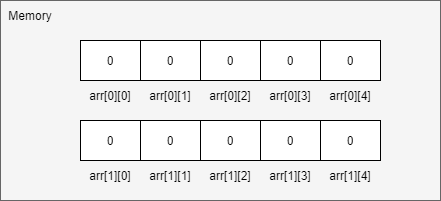
```
int[][] arr = new int[][] {  // creates a two-dimensional array definition with "2" rows and "5" columns and initializes it with values
  {1, 2, 3, 4, 5},     // the first row 
  {11, 12, 13, 14, 15} // the second row
}                                  
```


#### Ragged Arrays
An array will be called as "ragged", when it doesn't have a form of "rectangular" and the number of columns may not be fixed. In this case during its definition we specify only the 1st "dimension" and another "dimensions" are left unknown. 
```
int[][] arr = new int[3][]; // creates a two-dimensional "ragged" array
arr[0] = new int[3];        // initializes the first row
arr[1] = new int[2];        // initializes the second row
arr[2] = new int[1];        // initializes the third row
```
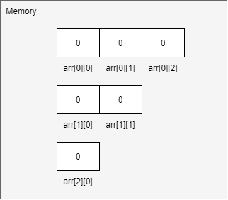

```
int[][] arr = new int[3][];  // creats a two-dimensional "ragged" array
arr[0] = new int[]{1};       // initializes the first row
arr[1] = new int[]{1, 2};    // initializes the second row
arr[2] = new int[]{1, 2, 3}; // initializes the third row
```


### Linked List
#### Overview
A linked list is a linear data structure, which that includes a sequence of connected nodes: each node has the data and the address (reference/link) of the next node in the linked list. Such an address is called a "next pointer". Linked lists have a special member called "Head", which gives the address of the first node. If a linked list is empty, a value of "head" will point at "nowhere", e.g. "null". The last node is always points at "null" (as we already discussed at "nowhere"). In other works, a linked list is a bunch of randomly organized memory addresses, which are linked together. Linked list is the second most-used data structure after an array.


### Need of Linked Lists
With linked lists, you never have to move your items: linked lists have the ability to break the chain and rejoin it. In other words, if you wanted to put a new element between Node №1 and Node №2, the steps would be:
- Create a new Node and allocate memory to it;

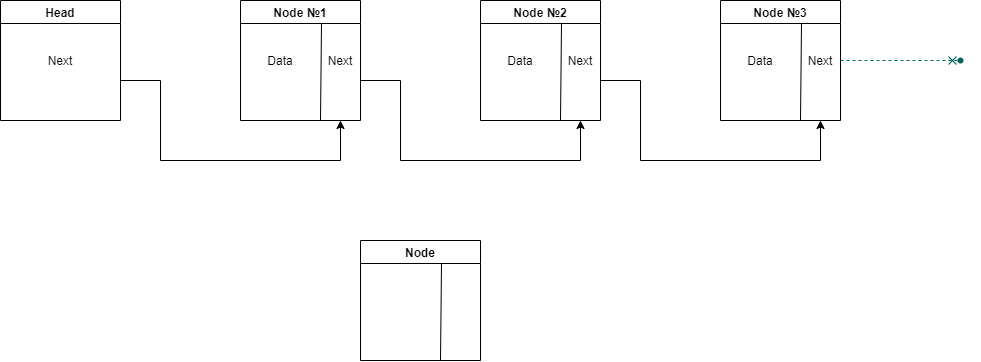

- Add a new "data" value;

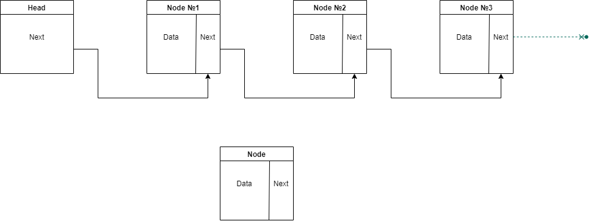

- Point its "next" pointer to Node №2;

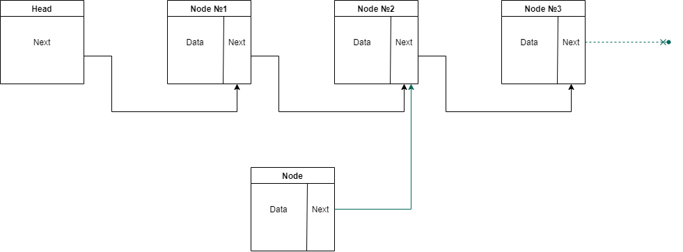

- Change the "next" pointer of Node №1 to a newly created Node.

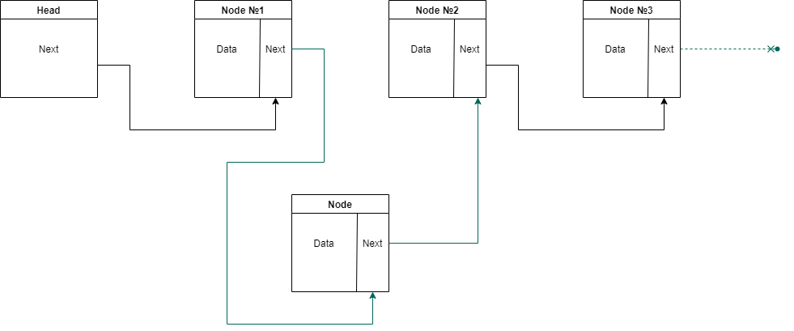

Doing something similar in an array would have required shifting the positions of all the subsequent elements.

### Pros and Cons of Arrays and Linked Lists
Which data structure should we use: arrays or linked lists? It depends only on a particular use case and goals, which we intend to resolve. In order to make a balanced decision, we should know pros and cons of these data structures.

#### Situation №1: Read of the last element
A read operation is heavily tied to type of access. There are two types of access to elements of a data structure: random access and sequential access.
Sequential access means reading all elements one by one starting from the 1st element. Random access means that we can reach a needed element directly. Linked lists can only perform sequential access, when arrays can do both sequential and random types of access.

Reading of the last element may be a quite heavy operation for a linked list: we can't just read it, because you don't know what address it has. We have to go to Node №1 to get the address for Node №2, then until we get to the last Node. Thus, linked lists are great if we are going to read all the Nodes one at a time, and they are terrible, if we are planning to jump around its Nodes: first, access the last element, then the 3rd element, then the last once again.

Regarding arrays, we know the address for each element, therefore arrays are great if we want to read random elements, because you can look up any element in your array instantly.

#### Situation №2: Insert a new element
Let's suppose a situation when we should insert a new element in a collection. As concerns linked lists, this operation will be very cheap, because we should just make a previous node point at a newly created node. An example of insertion can be found [here](#need-of-linked-lists).

Regarding arrays, while inserting an element into an array, we have to shift the rest of elements one step down. It means that if there are other elements after an element, which is to be inserted, we have to place each of these elements to an array's cell on the right. 

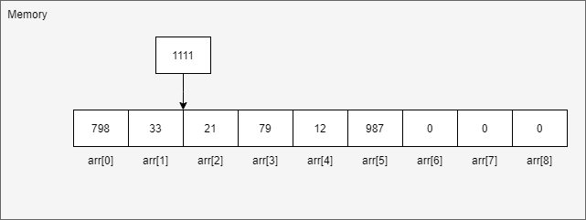
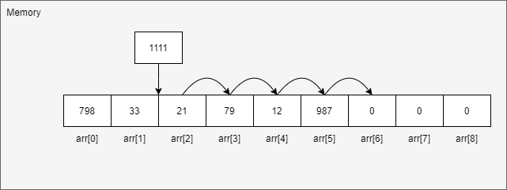
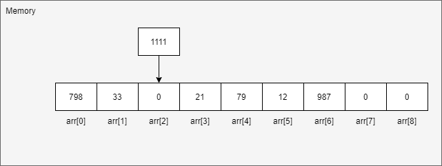


If there are no vacant cells in an array, besides "shifting elements down", we will also have to copy contents of an initial array to another location. An example of copying an array can be found [here](#copying-an-array).


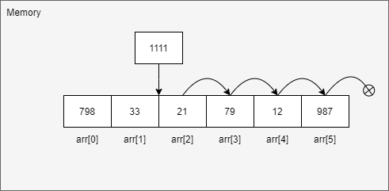
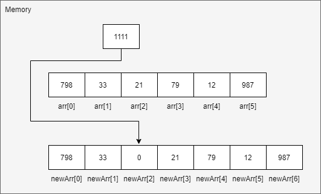


Thus, linked lists are better than arrays if we want to insert elements into the middle. 

#### Situation №3: Delete an element
As concerns deleting an element for linked lists, we should just make the previous node point at the next node, and we should delete a pointer from a node, which is being deleted.


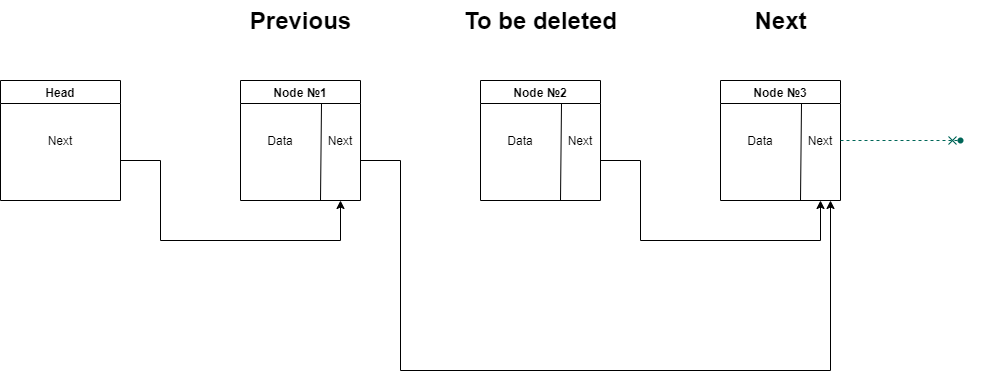


While speaking about arrays, we should wipe an element by shifting all elements on the right one step up. It means that if there are other elements after an element, which is to be deleted, we have to place each of these elements to an array's cell on the left.

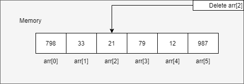
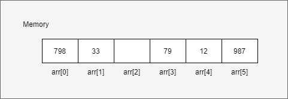
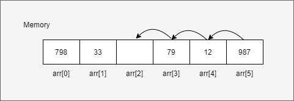
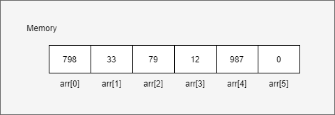

Thus, linked lists are also better than arrays if we want to delete elements from the middle.

#### Arrays and Linked Lists Time Complexity
Summarizing the aforementioned situations, here is provided "Time Complexity Chart" for main operations with arrays and linked lists. It can be used while choosing between arrays and linked lists depending on a task, which is being solved.  
https://www.programiz.com/dsa/linked-list

| Operation | Arrays | Linked Lists |
| --- | --- | --- |
| Reading | O(1) | O(n) |
| Insertion | O(n) | O(1) |
| Deletion | O(n) | O(1) |

### Summary
- Data structures should be treated as a method to store information;
- Arrays and linked lists are used, when it is necessary to store multiple elements; 
- Arrays and linked lists are basic data structures and are used to implement other data structures too;
- Elements of arrays are stored next to each other in memory;
- Elements of linked lists are allocated in memory with no order and contain only a reference to a next element;
- Arrays provide fast read operations;
- Linked Lists provide fast insert and delete operations.

## Recursion
Recursion is a programming technique using function or algorithm that calls itself one or more times until a specified condition is met, wherein the result is processed beginning from the repetition, which is last called, to the repetition, which is called first. Problems, which are solved by recursion, can also be resolved by iteration, i.e. using loops (for, while, do-while). But recursion solutions tend to have fewer steps than non-recursive solutions: this means that they are easier for humans to read.

Every recursion function consists of two parts:
- base case: the function, which produces a result without recurring;
- recursive case: a call of itself with the another [input](#what-is-algorithm).

"Base case" terminates the chain of recursion. The job of the recursive cases can be seen as breaking down complex inputs into simpler ones.

### Example
Imagine a problem of calculating the sum of natural numbers from 1 to "7". The sum of such number will be "28": "1+2+3+4+5+6+7=28".

#### With Recursion
```
public static int sum(int n) { // recursion function "sum" 
    if(n == 1) {
        return 1;              // base case
    }
    
    return n + sum(n-1);       // recursive
}
```

```
int sumFrom1To7 = sum(7);          // calculates recursively the sum
System.out.println(sumFrom1toTo7); // print the sum

// Output: 28
// 1 call: sum(7) → 7 + sum(6) //                          7 + 21 = 28
// 2 call: sum(6) → 6 + sum(5) //                      6 + 15 = 21 (↑)
// 3 call: sum(5) → 5 + sum(4) //                  5 + 10 = 15 (↑)
// 4 call: sum(4) → 4 + sum(3) //               4 + 6 = 10 (↑) 
// 5 call: sum(3) → 3 + sum(2) //        3 + 3 = 6 (↑) 
// 6 call: sum(2) → 2 + sum(1) // 2 + 1 = 3 (↑)
// 7 call: sum(1) → 1          //  1 (↑)
```

#### With Iteration

```
private static int sum(int maxNumber) {
    int sum = 0;
    for (int i = 0; i <= maxNumber; i++) {
        sum = sum + i;
    }
    return sum;
}
```

```
int sumFrom1To5 = sum(5);
System.out.println(sumFrom1To5);

// Output: 15
// int = 0: 0 + 0 = 0 (↓)
// int = 1:            0 + 1 = 1 (↓) 
// int = 2:                       1 + 2 = 3 (↓)
// int = 3:                                  3 + 3 = 6 (↓)
// int = 4:                                             6 + 4 = 10 (↓)
// int = 5:                                                         10 + 5 = 15
```

### How to create a recursion function
1. Define a base case;
2. Define 
3. Verify that when algorithm is run, the base case will always be reached.

Recursion functions can have more than one base case.

### Summary
- Recursion is when a function calls itself.

## "Divide and conquer" algorithm design paradigm
"Divide-and-conquer" is a technique for solving problems, when algorithm recursively breaks down a problem into two or more sub-problems of the same or related type, until they become simple enough to be solved directly. Then the solutions to the sub-problems are combined to give a solution to the original problem.

"Divide-and-conquer" is not just an algorithm, which solves a problem, instead, it is a way how to think about a problem.
While implementing a "Divide-and-conquer" algorithm, we should define the following its main steps:
1. _Divide_ a problem into a number of sub-problems that are smaller instances of the same problem;
2. _Conquer_ sub-problems by solving them recursively: a sub-problem is small enough, when it can be salved as a base case;
3. _Combine_ solutions to sub-problems into solution to an original problem.

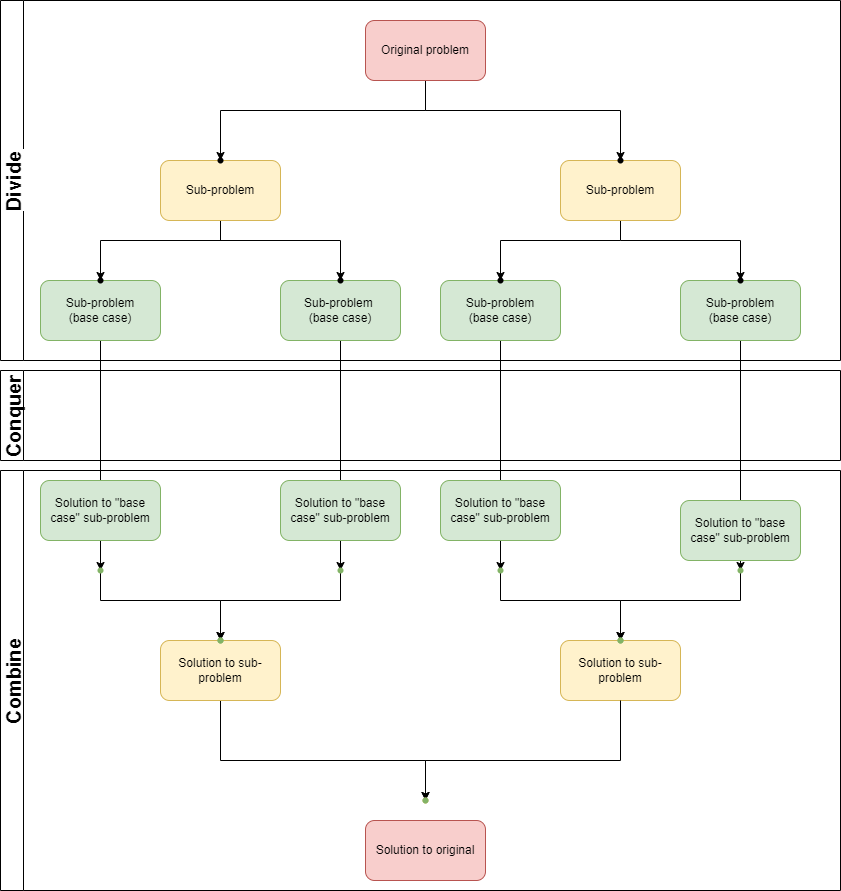

"Divide and conquer" algorithm design paradigm is the basis of _**efficient**_ algorithms for many problems, such as searching and sorting.

### Searching
Binary search is a great example of searching "divide and conquer" algorithms. It finds an item in a sequence of items. It works by dividing a sequence array into two smaller sub-sequences, then it discards one of the sub-sequences and continues the search in other sub-sequences.

In order to decide, which sub-sequence should be discarded, we compare a search key with an element in the middle of a sequence. If a value of a search key is less than an item in the middle of a sequence, we should discard a "higher" sub-sequence, otherwise, "lower" one should be discarded.

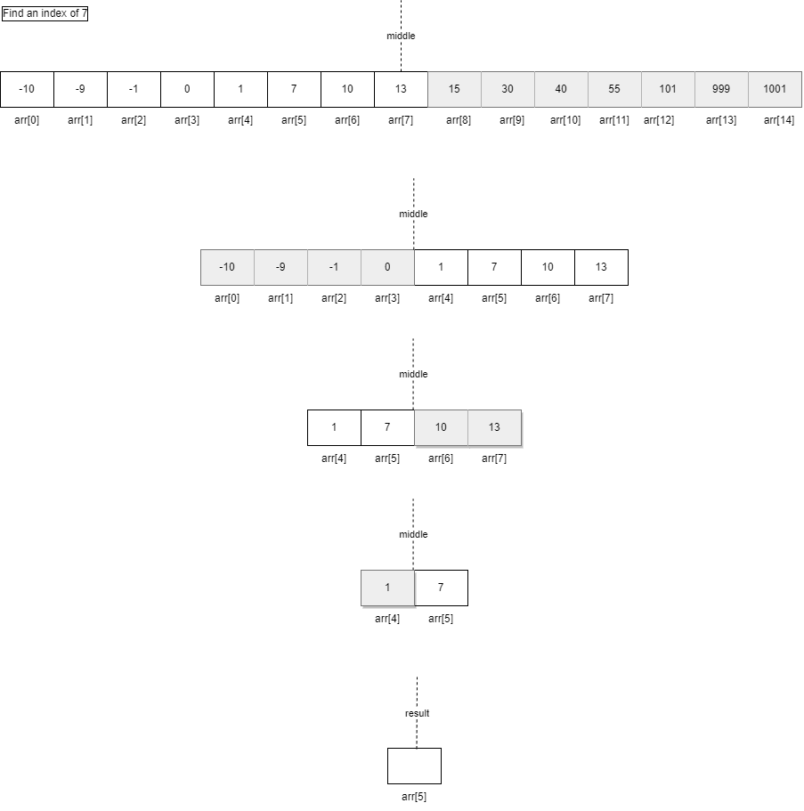

In order to use this algorithm, a sequence must be sorted, thus let's move to a sorting algorithm.

### Sorting
The merge sort algorithm is also closely compliant with the divide and conquer paradigm. Using the merge sort algorithm, we divide a sequence, which is to be sorted and which has a size of "n" elements, into two subsequences with a size of "n/2" each. Next, we sort two sub-sequences recursively calling "merge sort", unless all elements are separated individually. Then, pairs of individual elements are compared, placed into order and combined. We are combining two sorted subsequences, until they to produce a final sorted sequence.

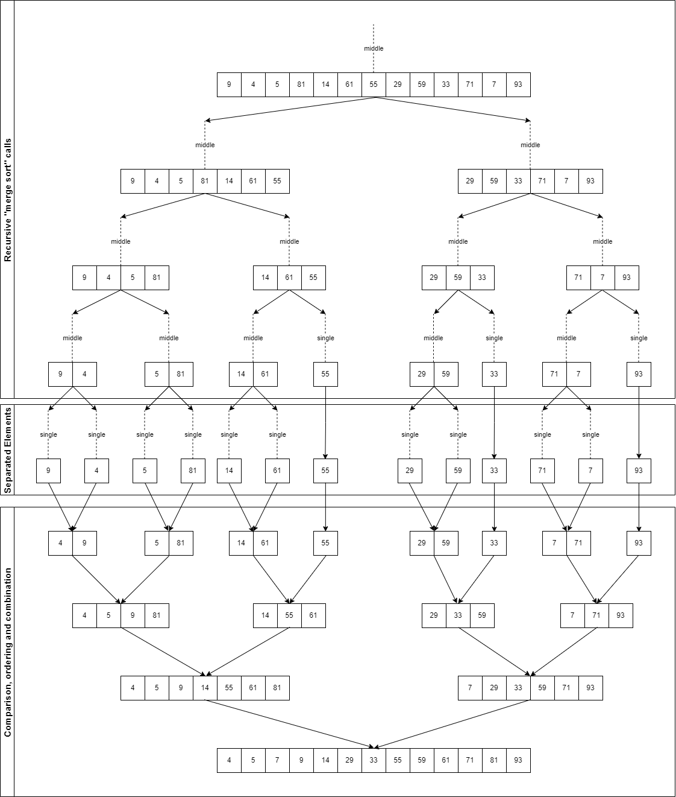

### Summary
- "Divide and conquer" algorithms split a problem into smaller and smaller pieces until they become elementary and easy to solve.

## Hash Tables
A hash table is a data structure that implements an associative array, where is stored as a collection of key-value pairs. The position of the data within the array is determined by applying a hashing algorithm to the key - a process called hashing. The hashing algorithm is called a hash function.

### Associative Array
It is an abstract data type, containing "key/value" pairs, when each possible key can appear only once in the collection. The size of this array must be planned carefully, because it must be big enough to store all data, but it must not be so large to waste space.

### Load Factor
Load Factor allows us to determine a right size of an associative array. The load factor of a hash table can be defined as:
`loadFactor=n/k`
where `k` is a total number of nodes (positions) in the array and `n` is a number of occupied nodes. Keeping the load factor at around `0.75` is optimal.

### Hash Function
Hash function is an algorithm, which converts a key to a "hash value", that is an encrypted number, which should be consistent: a key should always have the same hash value after applying the same hash function. On the basis of hash value, hash function determines an exact index of an associative array, where data should be stored. Hash function provided only valid indices.

### Hash Table Activity Diagram


### Hash Table Operations
Hash tables offer a combination of efficient search, insert and delete operations.
In order to insert data into a hash table, it is necessary to use a hash function, so that to generate an array index, which will be used to store the data.
In order to retrieve a value from a hash table, it is also to apply hash function to a key, so that to generate an index for a position within the array, then access the index and retrieve a value. Thus, data can be retrieved in a single operation without a necessity to carry out binary or other searches: we just refer to a correct position within an array.

### Collisions
The most common problem of hash tables is collisions. Collisions occur when a hash function produces the same "hash value" for two different key/value pairs. Every hash function is likely to produce such issues, and it doesn't matter how good it is read. Therefore, in order to implement a hash table, it is necessary to handle collisions.
The most popular way of dealing with collisions is "Chaining", when a "key/value" element of an associate array (Node) contains a pointer to the next element with the same "hash value".


## Summary
- a hash table is combined from an array and a hash function; 
- operations with hash tables are fast;
- it is necessary to create a hash function which reduces collisions.

## References
1. [[BOOK] Grokking Algorithms An illustrated guide for programmers and other curious people](https://www.manning.com/books/grokking-algorithms?gclid=EAIaIQobChMIiMvGzdvU8wIVjbWyCh3XkgpuEAAYASAAEgKvDfD_BwE)
2. [Time complexity](https://en.wikipedia.org/wiki/Time_complexity)
3. [Big O Notation, Massachusetts Institute of Technology](https://web.mit.edu/16.070/www/lecture/big_o.pdf)
